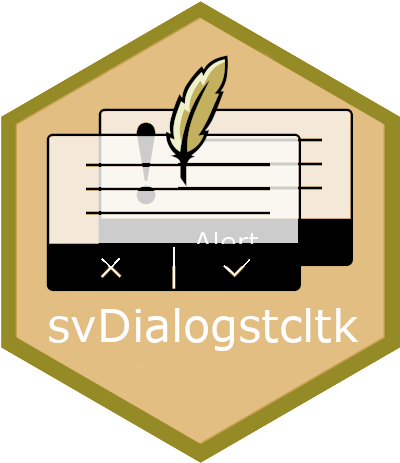

<!-- README.md is generated from README.Rmd. Please edit that file -->

# ‘SciViews::R’ - Standard Dialog Boxes using Tcl/Tk <a href="https://www.sciviews.org/svDialogstcltk"></a>

<!-- badges: start -->

[](https://github.com/SciViews/svDialogs/actions/workflows/R-CMD-check.yaml)
[](https://codecov.io/gh/SciViews/svDialogstcltk)
[](https://cran.r-project.org/package=svDialogstcltk)
[](https://sciviews.r-universe.dev/svDialogstcltk)
[](https://www.gnu.org/licenses/gpl-2.0.html)
[](https://www.tidyverse.org/lifecycle/#stable)
<!-- badges: end -->

With {svDialogs}, you can rapidly construct standard dialog boxes for
your GUI, including message boxes, input boxes, list, file or directory
selection, … The {svDialogstcltk} adds equivalent dialog boxes build
with TK, i.e., using the {tcltk} R package.

## Installation

You can install the released version of {svDialogstcltk} from
[CRAN](https://CRAN.R-project.org) with:

``` r
install.packages("svDialogstcltk")
```

You can also install the latest development version. Make sure you have
the {remotes} R package installed:

``` r
install.packages("remotes")
```

Use `install_github()` to install the {svDialogstcltk} package from
GitHub (source from **master** branch will be recompiled on your
machine):

``` r
remotes::install_github("SciViews/svDialogstcltk")
```

### Latest stable version

The latest stable version of {svDialogstcltk} can simply be installed
from [CRAN](http://cran.r-project.org):

``` r
install.packages(c("svGUI", "svDialogs", "svDialogstcltk"))
```

R should install all required dependencies automatically, and then it
should compile and install {svDialogstcltk}.

Latest devel version of {svDialogstcltk} (source + Windows binaries for
the latest stable version of R at the time of compilation) is also
available from
[appveyor](https://ci.appveyor.com/project/phgrosjean/svDialogstcltk/build/artifacts).

## Usage

You can get further help about this package this way: Make the
{svDialogstcltk} package available in your R session:

``` r
library("svDialogstcltk")
```

Get help about this package:

``` r
library(help = "svDialogstcltk")
help("svDialogstcltk-package")
vignette("svDialogstcltk") # None is installed with install_github()
```

For further instructions, please, refer to the help pages at
<https://www.sciviews.org/svDialogstcltk/>.

## Code of Conduct

Please note that the {svDialogstcltk} project is released with a
[Contributor Code of
Conduct](https://contributor-covenant.org/version/2/0/CODE_OF_CONDUCT.html).
By contributing to this project, you agree to abide by its terms.

## Note to developers

This package used to be developed on R-Forge in the past. However, the
latest [R-Forge
version](https://r-forge.r-project.org/projects/sciviews/) was moved to
this GitHub repository on 2018-04-02 (SVN version 569). **Please, do not
use R-Forge anymore for SciViews development, use this GitHub repository
instead.**
